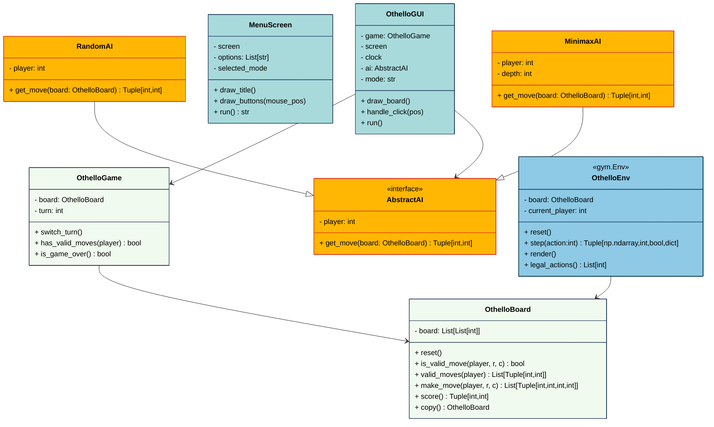

# Othello プロジェクト クラス図（色分け版）

```mermaid
classDiagram
    %% ==== GUI 系 ====
    class OthelloGUI {
        - game: OthelloGame
        - screen
        - clock
        - ai: AbstractAI
        - mode: str
        + draw_board()
        + handle_click(pos)
        + run()
    }
    class MenuScreen {
        - screen
        - options: List[str]
        - selected_mode
        + draw_title()
        + draw_buttons(mouse_pos)
        + run() str
    }

    %% ==== ゲーム盤・進行系 ====
    class OthelloBoard {
        - board: List[List[int]]
        + reset()
        + is_valid_move(player, r, c) bool
        + valid_moves(player) List[Tuple[int,int]]
        + make_move(player, r, c) List[Tuple[int,int,int,int]]
        + score() Tuple[int,int]
        + copy() OthelloBoard
    }

    class OthelloGame {
        - board: OthelloBoard
        - turn: int
        + switch_turn()
        + has_valid_moves(player) bool
        + is_game_over() bool
    }

    %% ==== AI 系 ====
    class AbstractAI {
        <<interface>>
        - player: int
        + get_move(board: OthelloBoard) Tuple[int,int]
    }
    class RandomAI {
        - player: int
        + get_move(board: OthelloBoard) Tuple[int,int]
    }
    class MinimaxAI {
        - player: int
        - depth: int
        + get_move(board: OthelloBoard) Tuple[int,int]
    }

    %% ==== 強化学習 / 環境系 ====
    class OthelloEnv {
        <<gym.Env>>
        - board: OthelloBoard
        - current_player: int
        + reset()
        + step(action:int) Tuple[np.ndarray,int,bool,dict]
        + render()
        + legal_actions() List[int]
    }

    %% 継承・実装関係
    RandomAI --|> AbstractAI
    MinimaxAI --|> AbstractAI

    %% 所持関係
    OthelloGame --> OthelloBoard
    OthelloGUI --> OthelloGame
    OthelloGUI --> AbstractAI
    OthelloEnv --> OthelloBoard

    %% ==== 色分け（個別に指定） ====
    style OthelloGUI fill:#a8dadc,stroke:#1d3557,color:#000000
    style MenuScreen fill:#a8dadc,stroke:#1d3557,color:#000000
    style OthelloBoard fill:#f1faee,stroke:#1d3557,color:#000000
    style OthelloGame fill:#f1faee,stroke:#1d3557,color:#000000
    style AbstractAI fill:#ffb703,stroke:#d62828,color:#000000
    style RandomAI fill:#ffb703,stroke:#d62828,color:#000000
    style MinimaxAI fill:#ffb703,stroke:#d62828,color:#000000
    style OthelloEnv fill:#8ecae6,stroke:#023047,color:#000000

```